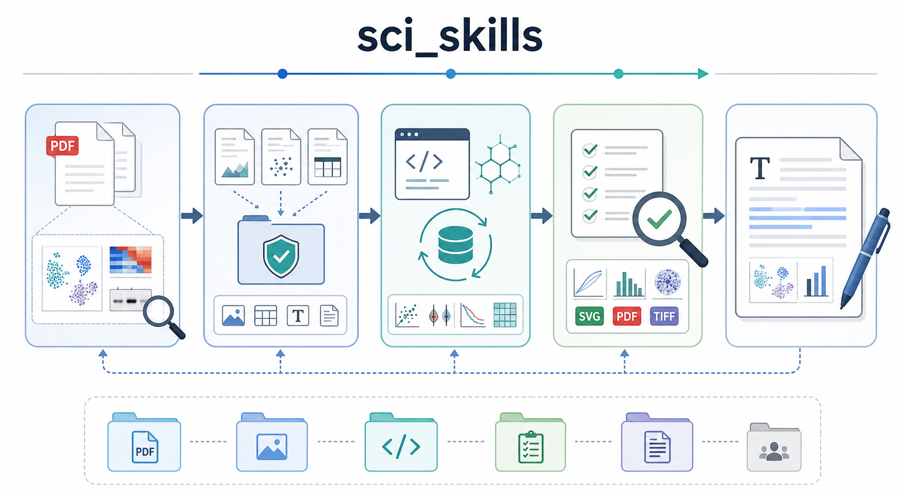

# sci_skills

`sci_skills` 是一组面向生物医学科研工作的 Codex skills。它把论文图件抽取、证据链记录、FigureYa 作图复用、Nature 图件合规检查，以及中英文论文表达修订放在同一个可维护仓库中。

当前版本：`0.4.1`。详细变更见 [CHANGELOG.md](CHANGELOG.md)。



## 项目理念

本项目的核心原则是：**先证据链，后表达和生成**。

论文 PDF、图页、caption、figure card、plot recipe、FigureYa 模块、QC 报告和论文文字不是彼此孤立的材料。它们应当通过明确的 handoff 串起来，使每一个视觉判断、作图选择和论文主张都能追溯到来源。

因此，`sci_skills` 默认不追求“把图画得像某篇文章”，而是提取可复用的抽象图形语法、统计表达、证据定位和合规规则，再用于用户自己的数据和论文写作。

## 工作流

| 阶段 | 主要 skill | 输出 | 质量门禁 |
| --- | --- | --- | --- |
| 论文图件抽取 | `paper-figure-extractor` | figure card、caption locator、plot grammar | 不复刻版权图；文本证据和图像证据分离 |
| 作图代码生成 | `nature-biofigure-coder` | R/Python plotting template、plot data contract | 统计、分组和比较方向必须来自 source 或用户数据 |
| FigureYa 复用 | `bioinformatics-figureya-plotting` | 模块匹配、适配后的可运行示例 | FigureYa 作为外部只读 backend；匹配置信度必须可见 |
| 图件合规评审 | `nature-figure-compliance` | QC report、多专家图件评审 | 尺寸、格式、可编辑性、图像完整性和缺失证据必须报告 |
| 论文表达修订 | `academic-chinese-style` / `nature-language-style` | 改写稿、claim-evidence map、自审问题 | Abstract/Introduction 的主张必须有证据或标记 `needs evidence` |

完整架构见 [docs/ARCHITECTURE.md](docs/ARCHITECTURE.md)。外部参考项目、许可证和改写边界见 [docs/ATTRIBUTION.md](docs/ATTRIBUTION.md)。

## Skills

| Skill | 用途 |
| --- | --- |
| `academic-chinese-style` | 中文生物医学论文、综述、基金和图文叙事的章节逻辑、段落流、claim-evidence 对齐和克制表达。 |
| `bioinformatics-figureya-plotting` | 检索和适配 FigureYa 模块，用真实输入复用生信作图流程。 |
| `nature-biofigure-coder` | 将 figure card 或 plot recipe 转换为可复现的 R/Python 作图代码。 |
| `nature-figure-compliance` | 检查图件包的 Nature-family 规格、导出格式、可编辑性、完整性和投稿风险。 |
| `nature-language-style` | 提取和应用 Nature-family 英文写作风格，控制 hedging、overclaim 和语言边界。 |
| `paper-figure-extractor` | 从生物医学论文中抽取 source-grounded figure card 和可复用 plot grammar。 |

## 安装

安装单个 skill：

```powershell
python $env:CODEX_HOME\skills\.system\skill-installer\scripts\install-skill-from-github.py `
  --repo luvega/codex-skills `
  --path skills/academic-chinese-style
```

安装完整图件与写作工作流：

```powershell
python $env:CODEX_HOME\skills\.system\skill-installer\scripts\install-skill-from-github.py `
  --repo luvega/codex-skills `
  --path skills/paper-figure-extractor `
  --path skills/nature-biofigure-coder `
  --path skills/bioinformatics-figureya-plotting `
  --path skills/nature-figure-compliance `
  --path skills/nature-language-style `
  --path skills/academic-chinese-style
```

安装或更新后重启 Codex。

## 验证

运行完整测试：

```powershell
python -m unittest discover -s tests -v
```

运行关键 deterministic checks：

```powershell
python scripts\check_skill_metadata.py skills
python scripts\check_figure_evidence_passport.py tests\fixtures\valid_figure_evidence_passport.json
python scripts\check_claim_evidence_map.py path\to\writing-output.md
git diff --check
```

## Local-Only 数据边界

以下目录是本地工作数据，默认不进入 Git：

- `literature/`
- `figure_skills_output/`
- `tmp/`

不要提交已发表 PDF、页面渲染图、抽取全文、复制图版或大规模生成图件。仓库只维护可复用 skill、schema、脚本、测试、redacted fixture、小型文档和 README 图示资产。

## 维护规则

1. 每个 skill 放在 `skills/<skill-name>/`。
2. `SKILL.md` 保持简洁，章节规则、脚本和素材放入 `references/`、`scripts/`、`assets/`。
3. 每个 `SKILL.md` 必须声明 `version`、`last_updated`、`status`、`data_access_level`、`task_type` 和 `related_skills`。
4. 能自动检查的约束优先写成 deterministic script，而不是只写提示词。
5. 借鉴外部 skill 仓库时保留 attribution，并避免整段复制 prompt、schema 或参考文本。
