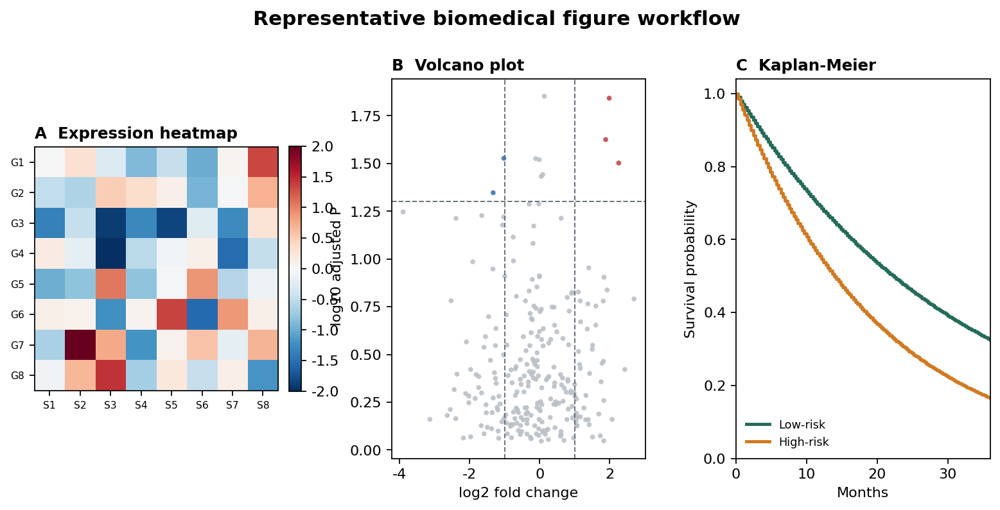
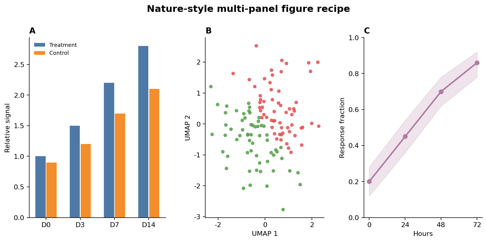
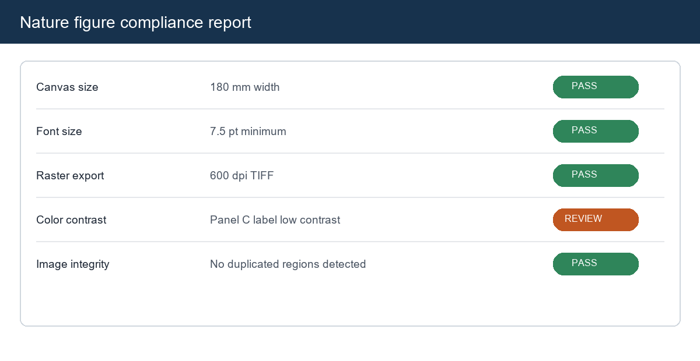
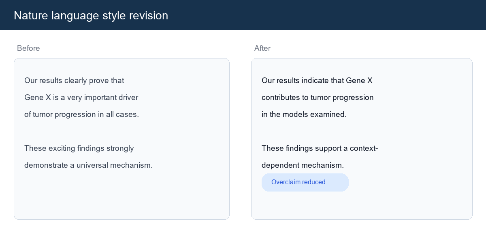
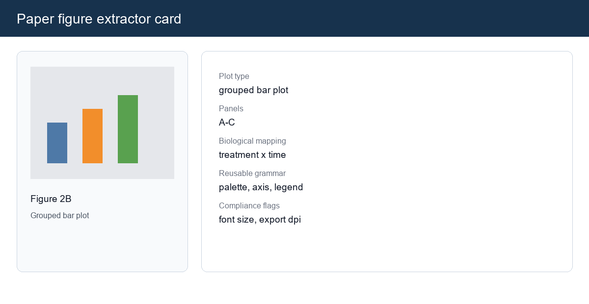

# Codex Skills

这个仓库用于集中维护可复用的 Codex skills，便于在不同电脑之间同步、安装和持续迭代。

## 目录约定

```text
skills/
  <skill-name>/
    SKILL.md
    agents/
    references/
    scripts/
    assets/
```

- 每个 skill 独立放在 `skills/<skill-name>/` 下。
- 仓库级 README 只写总览、安装和维护规则；skill 自身的使用说明放在各自目录里。
- 当前仓库采用“一个仓库管理多个 skill”的方式，适合跨电脑统一部署和版本控制。

## 已收录 Skills

| Skill | 用途 | 来源 |
| --- | --- | --- |
| `academic-chinese-style` | 对中文生物医学、综述、基金和论文文本进行学术风格润色、章节逻辑调整和过度表述检查。 | 本地写作流程整理 |
| `bioinformatics-figureya-plotting` | 基于 FigureYa 现有模块检索、改写和组合生物信息学作图流程。 | 本地 FigureYa 整理 |
| `nature-biofigure-coder` | 将图形需求转成更接近 Nature 风格的可执行作图方案与代码。 | `nature-biofigure-toolkit` |
| `nature-figure-compliance` | 对图件尺寸、字体、导出规格、图像完整性等进行合规检查。 | `nature-biofigure-toolkit` |
| `nature-language-style` | 对论文语言进行 Nature 风格润色、压缩和过度表述检查。 | `nature-biofigure-toolkit` |
| `paper-figure-extractor` | 从论文图件与正文中提取 figure card、plot recipe 和复用线索。 | `nature-biofigure-toolkit` |

## 示例输出

下面的图片是部分 skill 的代表性输出预览，用来说明它们各自服务的工作类型。

### `bioinformatics-figureya-plotting`



### `nature-biofigure-coder`



### `nature-figure-compliance`



### `nature-language-style`



### `paper-figure-extractor`



## 安装

### 安装单个 skill

```powershell
python $env:CODEX_HOME\skills\.system\skill-installer\scripts\install-skill-from-github.py --repo luvega/codex-skills --path skills/bioinformatics-figureya-plotting
```

如果没有设置 `CODEX_HOME`，可使用默认目录：

```powershell
python $HOME\.codex\skills\.system\skill-installer\scripts\install-skill-from-github.py --repo luvega/codex-skills --path skills/bioinformatics-figureya-plotting
```

### 安装整组 Nature 相关 skills

```powershell
python $env:CODEX_HOME\skills\.system\skill-installer\scripts\install-skill-from-github.py `
  --repo luvega/codex-skills `
  --path skills/nature-biofigure-coder `
  --path skills/nature-figure-compliance `
  --path skills/nature-language-style `
  --path skills/paper-figure-extractor
```

这 4 个 Nature skills 之间存在引用关系，推荐作为一组安装。

安装完成后，重启 Codex 以加载新 skills。

## 维护约定

1. 新 skill 一律放到 `skills/<skill-name>/`。
2. `SKILL.md` 保持简洁，详细规则、脚本和素材分别放入 `references/`、`scripts/`、`assets/`。
3. 共享规则如果会影响独立安装，优先复制到 skill 内部，而不是依赖仓库根目录的相对路径。
4. 提交前至少执行一次基础校验：

```powershell
python $env:CODEX_HOME\skills\.system\skill-creator\scripts\quick_validate.py skills\<skill-name>
```

5. 如果某一组 skills 之间存在强耦合，请在 README 中明确推荐一起安装，避免跨机器部署后出现隐式依赖缺失。
